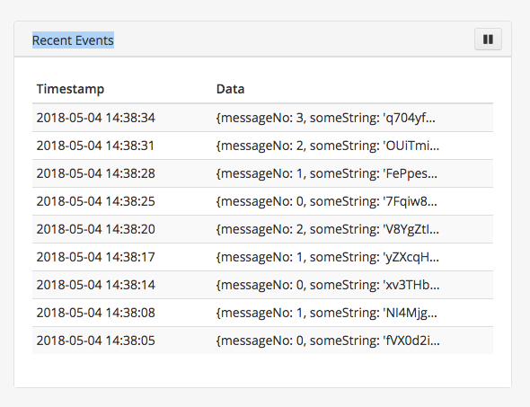

# data-integration-hackathon

Included is an example script *app.js* that sends random data to a Streamr stream. Also included is *package.json*
for dependency management and devops infastructure code (e.g. *Dockerfile*).

## Start here

### 1. Node and NPM
1. Make sure you have node and npm installed. `node -v` should be v8.0.0 or greater.

### 2. Get API Key
1. [Login](https://www.streamr.com/login/auth) or [register](https://www.streamr.com/register/signup) to Streamr
2. Grab your user API key from [here](https://www.streamr.com/profile/edit)
3. Export the API key with `export API_KEY=<YOUR_API_KEY_FROM_ABOVE>`

### 3. Clone repo and install dependencies
1. `git clone git@github.com:streamr-dev/data-integration-hackathon.git`
2. `npm install`

### 4. Edit and Run
1. Open *app.js* in your IDE/editor of choice
2. Edit constant `STREAM_NAME` (use your imagination, stream does not have to exist yet)
3. `npm start`
4. If everything works, you should see `Event sent: {...}` style logging in standard output.
5. Go to [Streams list page](https://www.streamr.com/stream/list), find your newly created Stream, and ensure data is
flowing in by looking at the Recent Events tab, e.g.,




### 5. Change remote origin
1. Create a new repository on GitHub (do not initialize with README!)
2. `git remote set-url origin <REPOSITORY_URL>`
3. `git push`


### 6. You are ready to hack!


## End here
- Customize `package.json` if needed
- Make sure `npm start` runs your script
- Make sure all dependencies are present in `package.json` (You can test this by removing *node_modules*, doing `npm install` and then making sure `npm start` starts without errors)
- Make sure you have configured the fields of your streams in Streamr.com (use autodetect for convenience).


## Deployment
Deployment requires only pushing into a docker registry
1 . Update travis_scripts/docker-build.sh
```
 export OWNER=<your docker name>
 export IMAGE_NAME=<the name of the image>
```

2 . Set up docker credentials
```
 export DOCKER_USER=<your docker name>
 export DOCKER_PASS=<docker password>
```
3 . Push to registry
```
./travis_scripts/docker_build.sh
```

4 . Send an email to mikhael.santos@streamr.com with:
* Docker owner/image_name
* Streamr Api key
* Stream Name


## Help

### Links
- [Documentation for streamr-client](https://github.com/streamr-dev/streamr-client)
- [Streamr API Swagger](https://www.streamr.com/help/api)

### Troubleshooting errors

**API key is wrong:**
```
Error: Request to https://www.streamr.com/api/v1/streams?name=my-sweet-stream&public=false returned with error code 401: {"code":"NOT_AUTHENTICATED","message":"Not authenticated via token or cookie"}
```
